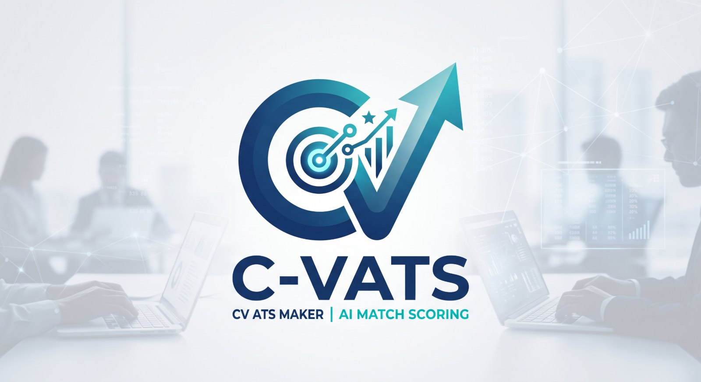
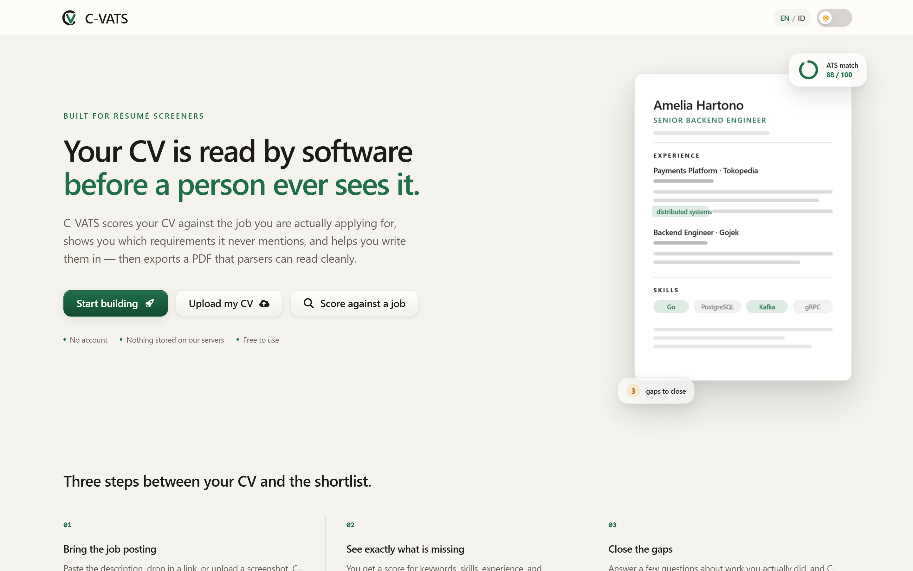
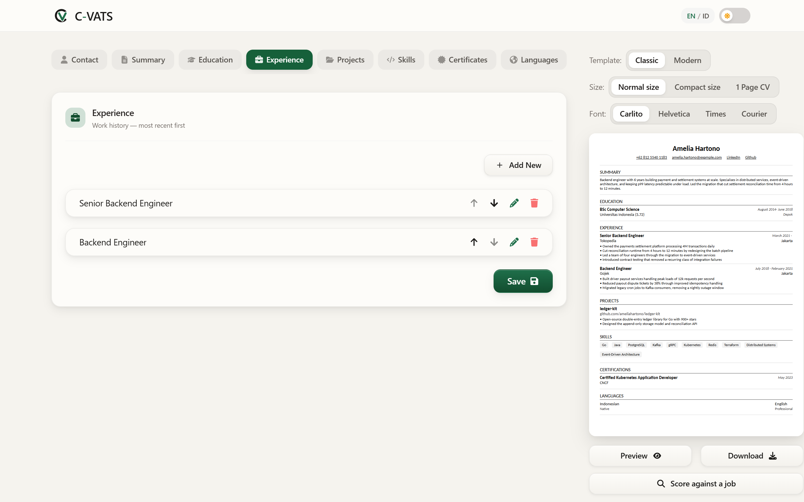
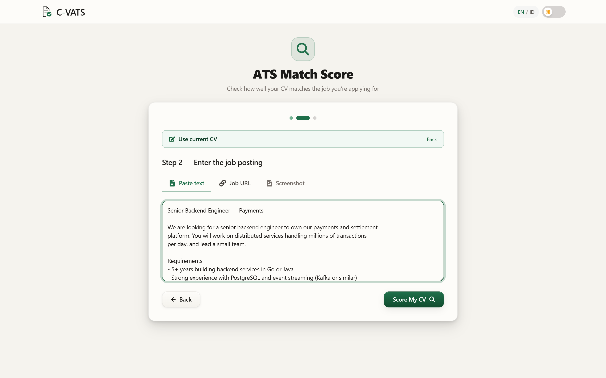
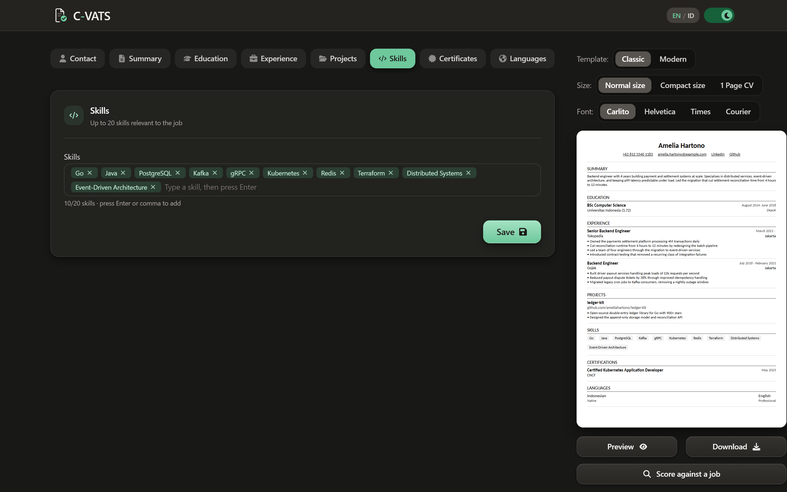

<div align="center">
  
  <p><strong>Your CV is read by software before a person ever sees it.</strong></p>
  <p>C-VATS scores your CV against the job you are actually applying for, shows you which requirements it never mentions, and helps you write them in — then exports a PDF that parsers can read cleanly.</p>
  <p>No account. Nothing stored on our servers. Free to use.</p>
</div>

---

## ✨ Features

| Feature | Description |
|---|---|
| **ATS Match Score** | Score your CV against a job posting — paste the text, give a URL, or upload a screenshot |
| **Gap Advisor** | Interviews you about work you actually did, then writes it in. Never invents experience |
| **Side-by-side diff** | Compare original and optimised CV before accepting anything |
| **AI CV Upload** | Upload an existing PDF and have the fields filled in automatically |
| **AI Refine** | Polish your summary, experience bullets, and project descriptions field by field |
| **2 Templates** | Classic (traditional) and Modern (contemporary) layouts |
| **4 CV Fonts** | Carlito, Helvetica, Times, and Courier — all ATS-safe, none add to the bundle |
| **3 Density Modes** | Normal, Compact, and a one-page fit |
| **PDF Export** | A4-ready PDF with selectable, parseable text |
| **No Account** | No sign-up or login required |
| **Privacy First** | Your CV lives in your browser — the server only relays AI calls |
| **Light / Dark** | Warm paper-and-ink palette, preference saved automatically |
| **EN / ID** | Fully bilingual interface — English and Bahasa Indonesia |

---

## 📸 Screenshots

**Landing** — the pitch, and a live look at what the scorer produces.



**Editor** — fields on the left, the real PDF rendering live on the right, with template, density, and font controls.



**Scoring** — bring the job posting as text, a URL, or a screenshot.



**Dark mode** — the same editor on ink instead of paper.



---

## 🛠 Tech Stack

| Layer | Technology |
|---|---|
| **Framework** | Next.js 14 (App Router) |
| **Styling** | Tailwind CSS + SCSS, class-based dark mode |
| **State** | Redux Toolkit + localStorage persistence |
| **PDF Generate** | @react-pdf/renderer — bundled Carlito plus the PDF standard-14 fonts |
| **PDF Preview** | react-pdf |
| **AI Providers** | Google AI Studio, Groq, OpenRouter — free-tier models with automatic fallback |

---

## 🚀 Local Setup

1. Clone the repository:
   ```bash
   git clone https://github.com/CharisChakim/c-vats.git
   cd c-vats
   ```

2. Install dependencies:
   ```bash
   npm install
   ```

3. Create `.env.local` and configure at least one AI provider:
   ```env
   # Google AI Studio — tried first, 1,500 req/day free (aistudio.google.com)
   GEMINI_API_KEY=your_key_here

   # Groq — tried second, 1,000 req/day free (console.groq.com)
   GROQ_API_KEY=your_key_here

   # OpenRouter — last resort, free-tier models (openrouter.ai)
   OPENROUTER_API_KEY=your_key_here

   # Optional: pin a specific OpenRouter model as its first choice
   # OPENROUTER_MODEL=openai/gpt-oss-120b:free
   ```
   **Any one key is enough.** Providers are tried in the order above and any
   without a key are skipped. Gemini and Groq go first because they are faster
   and less prone to timing out; OpenRouter's free models are the fallback.

4. Start the dev server:
   ```bash
   npm run dev
   ```

5. Open `http://localhost:3000` in your browser.

> On first visit each route is compiled on demand, so the very first navigation
> to the editor or scoring page can take a second or two. Production builds do
> not have this delay.

---

## 📄 License

MIT License — free to use and modify.

---

<sub>Inspired by <a href="https://github.com/devxprite/resumave">Resumave</a> by <a href="https://github.com/devxprite">@devxprite</a>.</sub>
